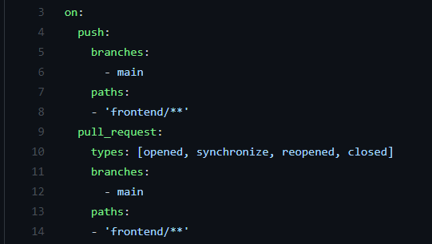
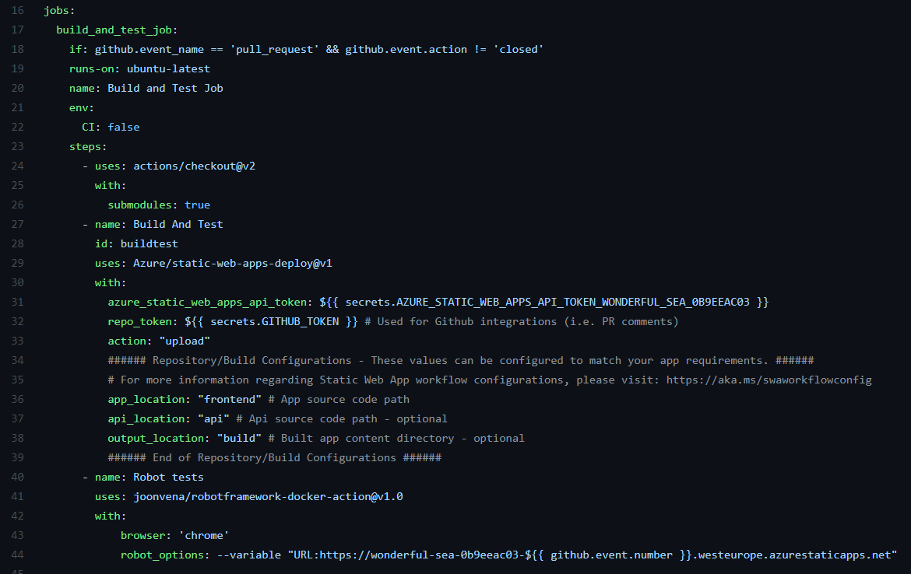

# Github Actions

Github Actions on jatkuvan kehityksen ja jatkuvan toimituksen (CI/CD) alusta, minkä avulla voidaan automatisoida build, testi ja deployment putkea. Automatisointi tapahtuu workflow tiedoston avulla, missä määritellään mitä ja milloin tehdään. Workflow-tiedostojen syntaksissa sisennykset pitää olla oikein, jotta tiedosto toimii.

Tässä projektissa on määritelty workflow tiedostot, mitkä seuraavat frontend- ja api-kansioiden muutoksia main-haarassa. Lisäksi on määritelty workflow tiedosto dev-haaran muutoksille, missä projektille ajetaan yksikkötestit.

1. Tehdään koodimuutoksia paikallisesti omassa haarassa ja pusketaan githubiin
2. Avataan pull request, jossa verrataan uutta haaraa dev-haaraan, jolloin yksikkötestit lähtevät ajoon
3. Tehdään merge dev-haaraan
4. Avataan pull request, jossa verrataan dev-haaraa mainiin
5. Workflow tiedoston build and test job lähtee käyntiin, missä sovellus buildataan ja deployataan stage sitelle, minkä jälkeen ajetaan robottitestit.
6. Tehdään merge main-haaraan, jolloin workflow tiedoston build and deploy job lähtee käyntiin, missä sovellus deployataan tuotantoon

## Github Actions avainsanat

Workflow tiedoston rakenne ja toiminnot määritellään erilaisten avainsanojen avulla. 

### on-avainsana

On-avainsana on pakollinen workflow tiedostossa minkä alla määritellään tapahtumat, joiden yhteydessä workflow käynnistyy. Lisäksi tapahtumien alle voidaan määritellä minkä haaran muutoksia tarkkaillaan branches-avainsanalla sekä paths-avainsanalla minkä kansion tai tiedostotyypin muutoksia.

Kuvasta näkee, että kyseinen workflow käynnistyy push ja pull-request tapahtumien yhteydessä. Lisäksi siinä on määritelty, että se tarkkailee muutoksia main-haarassa sekä muutoksia frontend-kansiossa.

### jobs-avainsana

Jobs-avainsanalla määritellään mitä workflow-tiedosto tekee. Jobs-avainsanan alle voi määritellä useamman jobin ja oletuksena ne ajetaan yhtäaikaisesti. Työlle määritellään id ja sen alle tulee pakollinen runs-on avainsana millä määritellään, millä alustalla job ajetaan.

Kuvassa näkyvä build_and_test_job buildaa Azure Static Web Appin ja luo sivusta staging siten, minkä jälkeen ajetaan robottitestit staging sitea vasten. Staging site on toimiva versio sovelluksesta, mutta muutokset eivät mene suoraan tuotantoon. Alussa olevassa if-lauseessa määritellään, että tämä jobi käynnisty, kun pull request aukaistaan.

## Pohdinta

Github Actions on erittäin monipuolinen työkalu, minkä avulla voidaan automatisoida töitä ja luoda CI/CD-putki. Github Actionsin käyttäminen on helppoa, sillä valmiita pohjia löytyy monenlaisia. Lisäksi integraatio Azuren ja Github Actionsin välillä on helppoa, sillä Azure-resurssiin pystyy linkittämään Github-repon ja workflow-tiedosto generoidaan automaattisesti. Workflow-tiedostoa pystyy muokkaamaan haluamakseen, mihin avuksi löytyy kattava dokumentaatio.